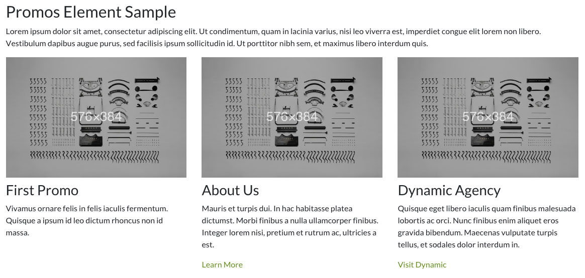
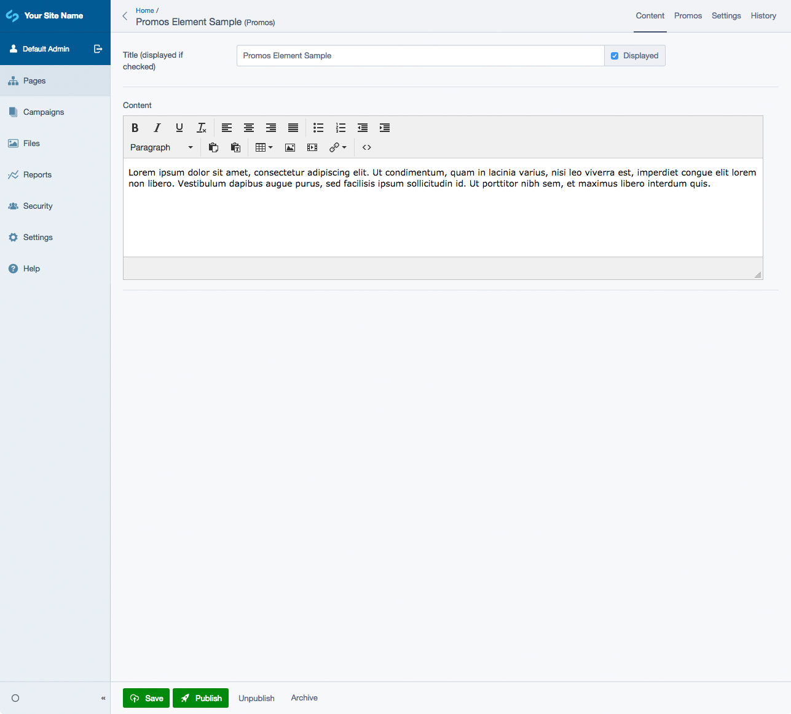

# Silverstripe Elemental Promos

A block to display a group of promos - a small card with an image, headline, short desciption, and link.

## Requirements

* dnadesign/silverstripe-elemental: ^4.0

## Installation

`composer require dynamic/silverstripe-elemental-promos`

## Usage

A content block to display a group of promos - a small card with an image, headline, short desciption, and link. Typically this will display 3 to 4 promos per row depending on layout restrictions. 

### Template Notes

The default templates are based off [Bootstrap 4](https://getbootstrap.com/) classes/styling

A simple display of the promos is being used by default in the `PromosSimple.ss` include. Also in the includes folder is another version, `PromosCardDeck` that uses the [Bootstrap 4 Card Deck](http://getbootstrap.com/docs/4.1/components/card/#card-decks).

## Screen Shots

#### Front End sample of a Promos Element

#### Alternate Front End sample of a Promos Element (uses Card Deck include)

#### CMS - Promos Main Tab

#### CMS - Promos Block - Promos List

#### CMS - Promos Block - Promo Edit

## Getting more elements

See [Elemental modules by Dynamic](https://github.com/dynamic/silverstripe-elemental-blocks#getting-more-elements)

## Configuration

See [SilverStripe Elemental Configuration](https://github.com/dnadesign/silverstripe-elemental#configuration)

